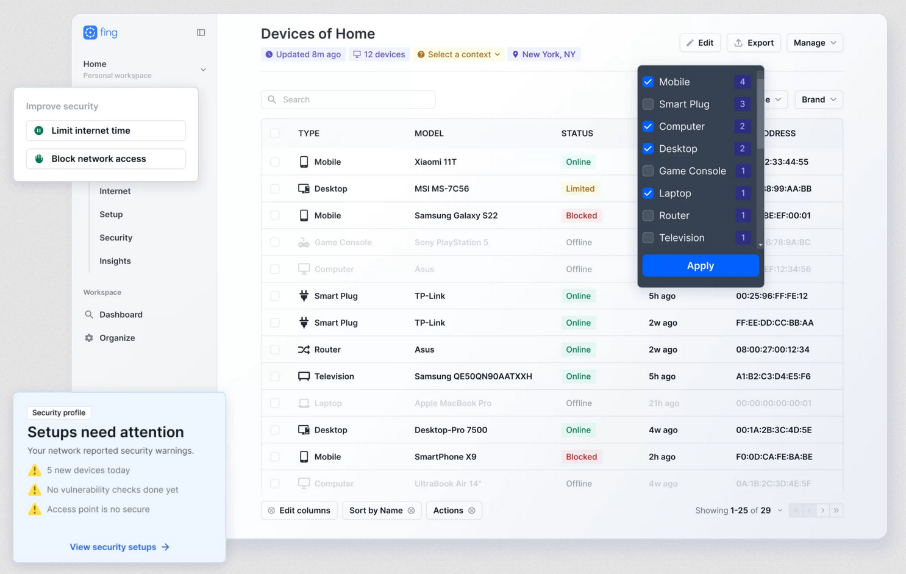

# Analysis

 

The Problem
---
Sysadmins are often unaware of unauthorized devices or hidden security flaws on a network. Stickbug Scanner will address this by automatically scanning networks to track device history, highlight changes and find vulnerabilities.

 

Primary User
---
My primary user will be the sysadmin of a local manufacturing company called Gary. They currently manage the entire network and they are in the process of upgrading the sites cybersecurity. They need an application to scan for vulnerabilities, collect data about each network device, and understand recent changes to the network.

Transcript of interview:
> Please describe the sitation  
> Gary: Well, say for instance a switch dies. Currently, to find problems in the network, I have multiple batch files which ping each known device, but this is slow and unreliable. It would be great for this process to be automatic. Also I would like to secure the network further by scanning specific devices for open ports, and unpatched software.  
> How would you like interact with this app. UI or CLI?  
> Gary: Definitely UI. I would like it to be intuative, instead of having to learn yet another set of CLI program commands.  
> Any personal UI preferences?  
> Gary: Yeah, I dont mind if the text is small, or I need a large monitor - I hate submenues.  
> What different information would you like to gather for each host?  
> Gary: I need the devices MAC address, IP address, hostname, location on the network, and main open ports. Also information about this device that I have added such as its name and description would also be great.  
> How many devices are on your network?  
> Gary: Around a hundred. It would be great if the scanning process was fairly quick as currently my batch scripts take ages to run.  
> How would you like these devices to be displayed? In an interactive graph system, or a long filter list?  
> Gary: Well after trying to implement network mapping software myself, I realise that you would likely have to have custom software running on each device for accurate network topology. This is not ideal as its yet another thing to maintain and keep secure. I am perfectly happy with a long list of devices that I can filter, provided I can filter them by their name, mac address, ip address of type. Still, it would be good if the app could give some sort of network location for each device.  
> Apart from scanning the network for new and down devices, collecting information about them and running vulnerability scans, is there anything else that you would like my app to do?  
> Gary: Its not critical, but being able to open a remote shell with specified user details would save me a lot of time when managing devices.  
> What device does the app need to run on?  
> Gary: I primarily use Linux.

| Specification Point | Primary User Requirement | Success Criteria | Necessity |
|-|-|-|-|
| 01 | Application has intuative and simple UI | There are no submenus, each button is clearly labeled, and different functions of the software are clearly separated | Critical |
| 02 | Scans complete within a much short period of time than Gary batch scripts | Time efficiency of the device scan is more efficient that O(n) | Critical |
| 03 | App has a persistent list of known devices with name and description | Device information is linked to its MAC address and stored on disk This is then loaded in when the app is opened | Critical |
| 04 | Device list displays the state of all known and unknown devices | The device list is made up of all saved devices, then the scan populates/updates the device state information and adds any unrecognised devices | Critical |
| 05 | Device list can be filtered by device name, IP address, MAC address, or group | App has a filter algorithm which identifies what type of search term the user is using There is also a tag system for related groups of devices | Critical |
| 06 | More in depth scans can be run on filtered devices | There is a dropdown for the type of scan that should be run (device scan, open port scan, vulnerability scan, and full scan) | Critical |
| 07 | The scan also find the approximate network location of the device | The app displays the packet trace for each device to enable to user to know which switch its behind | Acceptable Limitation |
| 08 | Vulnerability scan can alert for known CVEs | When running a vulnerability scan, the app provides the code and url for each one that it finds | Acceptable Limitation |
| 09 | App can remotely manage network devices | User has ssh auth details input at the top of the app, and can click on a host to open a new remote shell and automatically log in | Acceptable Limitation |
| 10 | Linux support | The app can be opened on most mainstream Linux distributions | Critical |

 

Perspective Users
---

| Specification Point | Primary User Requirement | Success Criteria | Necessity |
|-|-|-|-|
| 11 | Windows Support | The app can be opened on Windows | Acceptable Limitation |
| 12 | UI has dark mode | No white unless its text | Acceptable Limitation |
| 13 | App is lightweight and fast | Opened within 2 seconds | Critical |

 

Analysis of Current Systems
---

#### Zenmap
Nmap is the industry standard network mapper used for discovery and security auditing. Zenmap is its official multi-platform GUI. Zenmap provides a visual representation of Nmap’s CLI. It allows users to make profiles for scans and view network topology.

  

How its relevant to my project:  
- Vulnerability & Port Scanning (Requirement 06 and 08). It uses NSE (Nmap Scripting Engine) to detect CVEs.
- Topology Mapping to visualize the network (Requirement 07), though as Gary noted, this is often messy without agents.
- Cross-Platform and runs natively on Linux and Windows (Requirement 10 & 11).

| Pros | Cons |
|-|-|
| Accurate OS and service fingerprinting (Requirement 04) | The UI is dated and has many submenus and tabs which Gary hates (Requirement 01) |
| Can save scan results to XML/text for persistence | Large scans can be very slow if not tuned correctly (Requirement 02) |
| Extensive library for vulnerability detection (CVEs) | The topology graph view is cluttered and difficult to filter |

 

#### Fing
Fing is a professional network toolkit for identifying devices, troubleshooting, and monitoring network security. Fing is known for having a massive proprietary database of MAC addresses, allowing it to identify exactly what a device is.

How its relevant to my project:  
- Device Identification (Requirement 03 and 04) by linking MAC addresses to specific manufacturer data and persistent names.
- Filtering & State to provide a list of of which devices are online and offline (Requirement 05).
- App is lightweight and scans are very fast and return results almost instantly (Requirements 02 & 13).

  

| Pros | Cons |
|-|-|
| Intuitive UI with clear labels and high scannability (Requirement 01) | Advanced features (like vulnerability blocking) are hidden behind a subscription paywall |
| Able to indentify unknown devices based on MAC address | Lacks remote shell capability that Gary would like |
| Fast/responsive app and scans are fast (Requirement 02 & 13) | Limited support for vulnerability scanning |

 

#### Angry IP Scanner
A fast and friendly network scanner that is widely used by sysadmins for simple pings and port checks. Angry IP is a lightweight, Java-based tool that focuses on scanning an IP range very quickly.

How its relevant to my project:
- Uses multi-threaded scans for speed (Requirement 02).
- It uses a filterable list instead of compelx graphs (Requirement 05).
- Allows for specific scripts to be programmed to get info like MAC address or NetBIOS name.

  

| Pros | Cons |
|-|-|
| Extremely lightweight and starts up instantly (Requirement 13) | Requires a Java Runtime Environment (JRE), which can be a hassle on some Linux distros |
| No submenus - all information is displayed in a single flat grid (Requirement 01) | Very basic vulnerability detection. It mostly just checks if a port is  open |
| Provides a comments field for devices (Requirement 03) | UI lacks a dark mode by default (Requirement 12) |

 

Research
---

#### Language
The programming language used for this project had a few simple requirements:
- cross-platform
- powerful networking
- reasonably fast
- easy installation

My shortlist was C++, Rust and Golang. Java was ruled out as although its fast, crossplatform and has powerful networking tools, they are also a pain to install on Windows. Also python was ruled out because its relatively slow.  
In the end I decided that it didnt really matter and they all fit the requirements so I picked Golang out of personal preference. It compiles fast, the package system is so much better than C++ linker files, and its go routines are awesome. Plus they are also lightweight (about 4kb or ram per async routine) which will be great for scanning for loads of devices at the same time.

 

#### UI
For the UI, I wanted something lightweight and immidiate. This means that the UI has a state and this state is rendered each frame. This means that to change the UI, all you have to do is change the state of the code that builds it, like how HTML in a browser works.
The three options for Golang that I found were:
- Gio
- Fyne
- GIU / cimgui-go

Again, they all fulfilled my requirements, so in the end I picked the Golang implementation for DearImGUI. This is a C++ crossplatform UI library with bindings to other languages (like Go). GIU and cigui-go are both examples of these, but GIU is a more modern implementation based on cigui-go.

https://github.com/AllenDang/giu

 

#### Data storage
For data storage, I went with the industry standard SQLite. I did explore other options, such as DuckDB. This would be theoretically be faster for filtering as its columnar, but I think that it would also be slower for individual updating and modification of stored devices. Without substantial testing I'm not sure what the fastest one would have been, but SQLite is still blazing fast and has great support with Golang. If speed is an issue (which I really doubt it will be) I can implement caching with memcached/dragonDB or something similar.

https://hannes.muehleisen.org/publications/SIGMOD2019-demo-duckdb.pdf
https://www.datacamp.com/blog/duckdb-vs-sqlite-complete-database-comparison

 

#### Device Scan
For the device scan, I researched implementing a Breadth First Traversal through the network, starting at the root gateway. However, there were multiple problems with this:
- Subnet isolation and network segmentation: ARP is a Layer 2 protocol and cannot cross routers. In a segmented network (like the one discovered in my home testing), a BFT fails to hop between subnets because the broadcast domain is restricted, leaving devices on other another (V)LAN invisible.
- Protocol being ignored sometimes: Many modern operating systems implement ARP ignore security policies. If the scanner’s IP is not on the same subnet as the target, the target will silently drop the request, breaking the traversal chain.
- Speed: A traditional BFT is sequential. To meet Requirement 02, I switched to a Parallel Horizontal Sweep. When I used Python thread pools in my testing, the scanner can "blast" ICMP and ARP packets across an entire /16 scope concurrently discovering all the devices on my home network in seconds rather than minutes.
- Reliability: BFT relies on identifying a neighbor to find the next branch. In environments with unmanaged switches or stealthy firewalls, these nodes don't always reveal their neighbors, making a brute-force sweep more reliable for finding unauthorised or hidden devices.

As such, the best and most reliable method I found was just blasting packets and seeing what stuck. Although this wasnt the fastest, it wasnt bad, especially with concurrency.

https://gobyexample.com/goroutines
https://www.fortinet.com/uk/resources/cyberglossary/what-is-arp
https://www.youtube.com/watch?v=4xaWoZE8eik
https://www.fortinet.com/uk/resources/cyberglossary/internet-control-message-protocol-icmp

 

#### Port Scan
I will implement my own port scanning algorithm to quickly allow users to see what services the online devices are hosting. I researched how Nmap does it and for a quick port scan, it starts a TCP handshake on each port, and if there is a response, then it just doesnt bother to finish it as the intention wasnt communication, it was discovery. This method is much faster and is called TCP SYN Scanning. I will implement this to find ports that shouldnt be open.

https://nmap.org/book/man-port-scanning-techniques.html

 

#### Vulnerability Scan
For the vulnerability scan, I will probably use Nmap, with a CVE detection script. It might also be an idea to enable the users to add/write their own custom scripts.

https://www.hackingloops.com/nmap-for-vulnerability-scanning/

 

#### Remote Management
I have a couple of options for this. I could open a shell for them and copy the ssh command, address and auth details to their clipboard. This would be effective, is a little crude. However, if they want to mass update something, then I could also allow them to run custom bash scripts (eg to update machines software versions etc). If I did this approach then I would use the following library which implements a golang ssh client.

https://github.com/melbahja/goph

 

#### Packet Trace
Unix systems have a tool called Traceroute, and Windows have a tool called Tracert. I will have to implement a way of detecting which one to use in my application.

https://support.n4l.co.nz/s/article/How-to-use-Tracert-Traceroute

 

Objectives & Acceptable Limitations
---

| Specification Point | Primary User Requirement | Success Criteria | Necessity |
|-|-|-|-|
| 01 | Application has intuative and simple UI | There are no submenus, each button is clearly labeled, and different functions of the software are clearly separated | Critical |
| 02 | Scans complete within a much short period of time than Gary batch scripts | Time efficiency of the device scan is more efficient that O(n) | Critical |
| 03 | App has a persistent list of known devices with name and description | Device information is linked to its MAC address and stored on disk This is then loaded in when the app is opened | Critical |
| 04 | Device list displays the state of all known and unknown devices | The device list is made up of all saved devices, then the scan populates/updates the device state information and adds any unrecognised devices | Critical |
| 05 | Device list can be filtered by device name, IP address, MAC address, or group | App has a filter algorithm which identifies what type of search term the user is using There is also a tag system for related groups of devices | Critical |
| 06 | More in depth scans can be run on filtered devices | There is a dropdown for the type of scan that should be run (device scan, open port scan, vulnerability scan, and full scan) | Critical |
| 07 | The scan also find the approximate network location of the device | The app displays the packet trace for each device to enable to user to know which switch its behind | Acceptable Limitation |
| 08 | Vulnerability scan can alert for known CVEs | When running a vulnerability scan, the app provides the code and url for each one that it finds | Acceptable Limitation |
| 09 | App can remotely manage network devices | User has ssh auth details input at the top of the app, and can click on a host to open a new remote shell and automatically log in | Acceptable Limitation |
| 10 | Linux support | The app can be opened on most mainstream Linux distributions | Critical |
| 11 | Windows Support | The app can be opened on Windows | Acceptable Limitation |
| 12 | UI has dark mode | No white unless its text | Acceptable Limitation |
| 13 | App is lightweight and fast | Opened within 2 seconds | Critical |

 

Modelling
---
There will be a main golang file which renders the UI and handles user interaction.

There will also be a models package, which handles database interaction, such as adding new hosts, modifying known hosts, deleting hosts, and filtering/getting known hosts. Filtering is complex as multiple things can be filtered, such as IP address, MAC address, name, and tags. These will be stored in a relational database (SQLite), and it needs to be handled quickly (eg list changing as the user is typing in their search term).

Then there will be a scanning package, which contains a few files, each dedicated to different scans. The scanning files will deploy a bunch of go routines to speed up the scanning process and make my app significantly faster than Gary's batch scripts.  
A scan will run like this:  
-> Scan button clicked  
-> many go routines are created to ping 10 ip addresses each  
-> for each live ip address a Multi-Port SYN Sweep scan is done (with even more go routines) and all the results are returned as a big list of network device objects  
-> known hosts are retreived from the database  
-> devices are merged based on the IP address  
-> unknown devices are found and flagged  
-> UI is updated  
This all needs to happen in a relatively short period of time.  

These scripts all need to be modular, meaning that they can be run as part of the full scan process, and also individually for a device when the user wants.