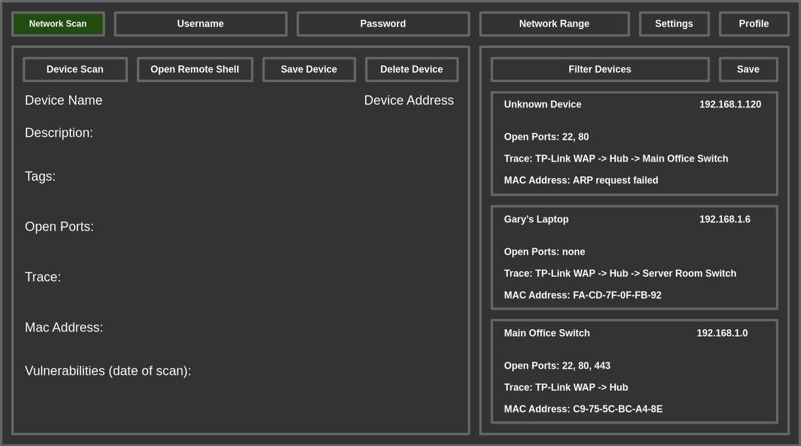
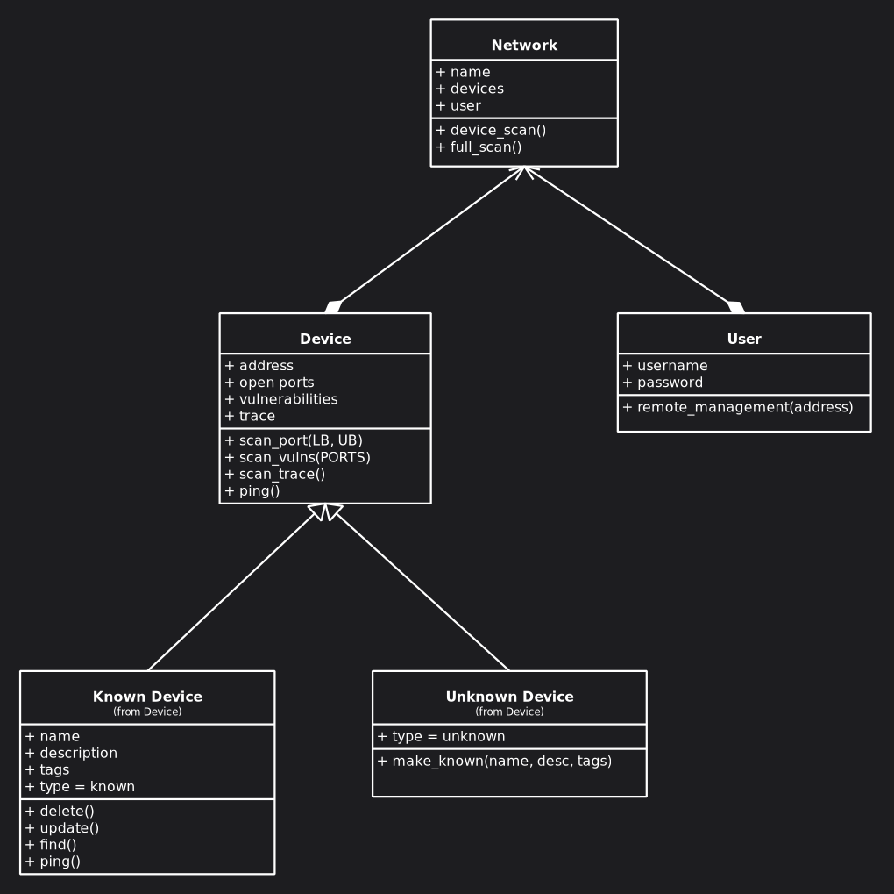
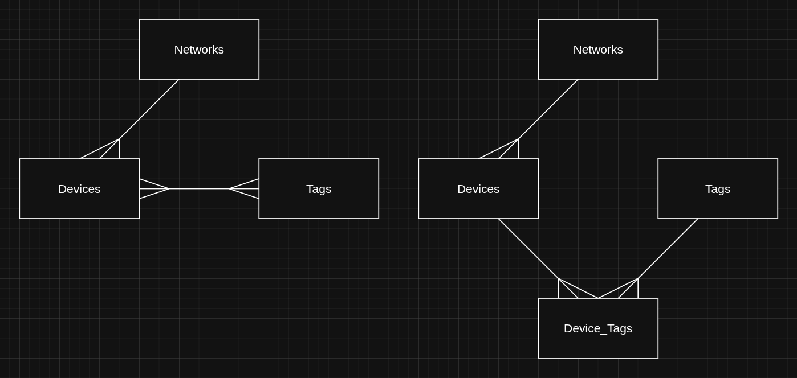

# Documented Design

 

Top Down Design
---

 

Program Flow Diagram
---

 

User Interface Design
---
I believe that development of an application should always start at the user level, what does the user want the program to do and how does the user want to interact with it. For this reason, the first thing that I started designing for my app was the UI. Below is a layout that I think fulfills Gary's success criteria (dark mode, no submenus and everything labeled).  
There are three text inputs at the top to enter your username and password when opening a remote shell and to define the network range for the scan. There is a start scan button which will change colour when a scan is in progress, and a settings button to configure what type of scan you would like to run. Lastly there is also a dropdown for the network profile so that the known device can be saved for each network that Gary is on.  
The devices are all saved to a certain network profile, which can be updated with the save button. The filter button next to it is used to filter the shown devices, and when a device is clicked, the details are loaded into the larger display to the left.

 

Data Flow Diagram
---

 

Algorithm Design
---

 

OOP Design
---
My project definitely calls for OOP as the scanning tool effectively models the network. Below is a UML diagram to visualise my objects and their relationships.  
The network profile is made up of device objects and a user object **(composition)**. Gary will be able to select which network profile is used, and therefore what devices are already known and the scan settings.  
The device class has two child classes **(inheritance/generalisation)** which inherit its attributes and methods. These also have scanning operations/methods, and the ping method is overridden the the Unknown Device child class **(overiding polymorphism)**. This is so that the known devices can have a quick TCP SYN Scan connection on a known open port, instead of a standard ICMP ping which all other devices would recieve. If the device does not respond to the port ping, then the scan falls back to ICMP to check if the service has stopped, or if the device is offline. 

 

Database Design
---
The following database design is almost fully normalised, but I decided to have the vulns and trace slices (dynamic arrays in go), encoded (possibly with binary json or something similar).  
This is because the results of these scans are already atomic. A node in a packet trace is only useful when in context with the rest of the nodes. Also, Requirement 02 & 13 demand that my application priorities speed of scans and a snappy interface. This data will only ever be required as a blob, and breaking it apart, only to JOIN it all back together is computationally inefficient.

NETWORKS(network_id, name, arp, networkRange, subnetMask)

DEVICES(device_id, network_id, ip_address, mac_address, vulns, trace)

DEVICE_TAGS(device_id, tag_id)

TAGS(tag_id, tag, colour)

Networks and Devices have a one to many relationship. A network can have many devices, but a device can only belong to one network.

Devices and Tags have a many to many relationship. A device can have many tags, and a tag can be assigned to many devices.

On the left is the conceptial Entity-Relationship Diagram, and on the right how it would be implemented in my relational database using a link table.

 

IPSO Chart
---
