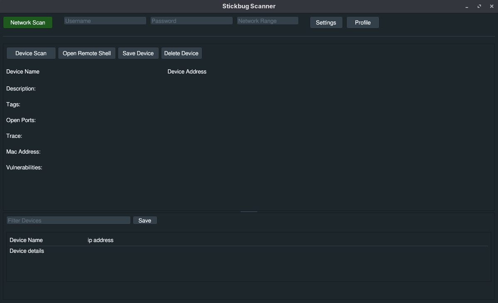
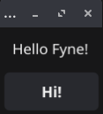
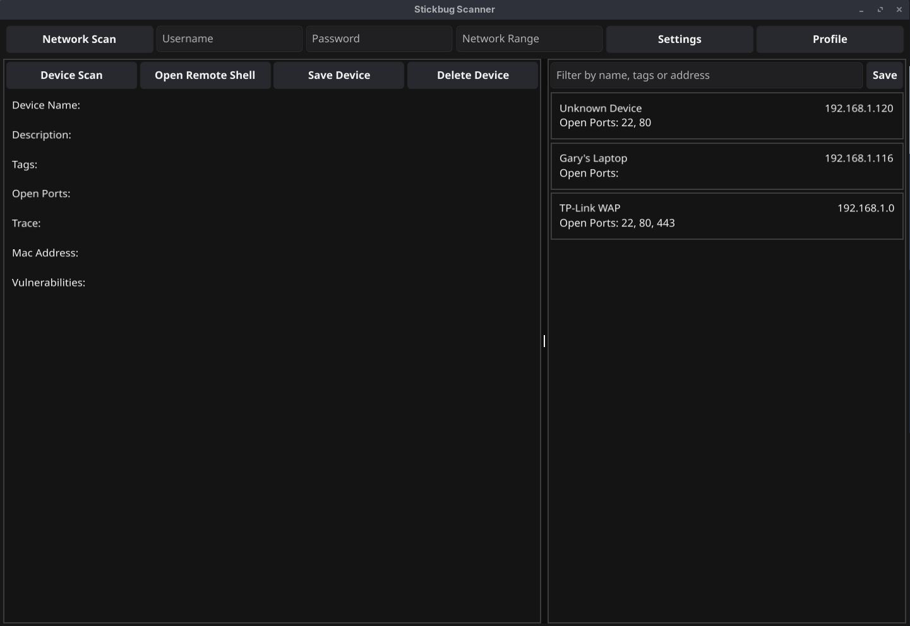

# Technical Solution

<br>

Environment Setup
---
#### Plan:
First thing first, I am using gui, which relies on underlying c++ (Dear ImGUI). As such, I need a c++ compiler installed.

Next, I installed the gui library by importing the package at the top of the page, and using "go mod tidy" to automatically download and install any required modules.

I also think that writing a quick make file to allow me to quickly compile for both windows and linux would be very helpful.


#### Code:
I used the following command on Linux to install my C++ compiler:
```
sudo dnf group install c-development development-tools
```
Then to install the UI library, I pasted in their Hello World example, and used "go mod tidy" to install the required packages.

```
package main

import (
		"fmt"

		g "github.com/AllenDang/giu"
)

func onClickMe() {
		fmt.Println("Hello world!")
}

func onImSoCute() {
		fmt.Println("Im sooooooo cute!!")
}

func loop() {
		g.SingleWindow().Layout(
				g.Label("Hello world from giu"),
				g.Row(
						g.Button("Click Me").OnClick(onClickMe),
						g.Button("I'm so cute").OnClick(onImSoCute),
				),
		)
}

func main() {
		wnd := g.NewMasterWindow("Hello world", 400, 200, g.MasterWindowFlagsNotResizable)
		wnd.Run(loop)
}
```

When this didnt work, I realised that although I had the c++ compiler installed, I didnt have the windowing subsystems that the underlying code relied on. To install these, I used:
```
sudo dnf install libX11-devel libXcursor-devel libXrandr-devel libXinerama-devel libXi-devel mesa-libGL-devel libXxf86vm-devel wayland-devel libxkbcommon-devel
```
I also verified that CGO was enabled with the following, but still the same result. No window
```
go env CGO_ENABLED
```
I was a little stumped for a while, so as a shot in the dark, I used the following flag -x to get an "extra verbose" output and gain a little more information. Surprisingly, I saw that the code was compiling, it was just taking a really long time as it was the first build of all of the dependancies. I was just being very impatient because I was expecting Go's usual speedy bulid process.


Next, the make file for cross compilation.
I needed to install the MinGW toolchain for cross-compilation from Linux:
```
sudo dnf install mingw64-gcc mingw64-gcc-c++
```

After a lot of web searches (the following links were the most helpful), I had the following Makefile.  
https://tutorialedge.net/golang/makefiles-for-go-developers/
https://www.alexedwards.net/blog/a-time-saving-makefile-for-your-go-projects

```
BINARY_NAME=stickbug
MAIN_PATH=./app/main.go

.PHONY: all linux windows clean

all: linux windows

linux:
	go build -v -o bin/$(BINARY_NAME) $(MAIN_PATH)

windows:
	CGO_ENABLED=1 \
	GOOS=windows \
	GOARCH=amd64 \
	CC=x86_64-w64-mingw32-gcc \
	CXX=x86_64-w64-mingw32-g++ \
	go build -v -ldflags "-H=windowsgui -extldflags=-static" -o bin/$(BINARY_NAME).exe $(MAIN_PATH)

clean:
	rm -rf bin/
```


#### Testing:
| Objective Tested | Input Data | Expected Result | Actual Result | Image | Pass/Fail |
|-|-|-|-|-|-|
|Hello World code runs|go run app/main.go|A window opens|The code just hangs and nothing appears|  | Fail |
|Hello World code runs|go run app/main.go|A window opens|The code just hangs and nothing appears|  | Fail |
|Hello World code runs|go build -x -v -o test_gui app/main.go && ./test_gui|A window opens|It does actually open, and the buttons work!|  | Pass |
|Hello World code runs from Makefile on linux|make linux|A window opens|stickbug binary is produced, and the Hello World window opens|  | Pass |
|Hello World code runs from Makefile on windows|make windows|A window opens|stickbug binary.exe is produced, and the Hello World window opens|  | Pass |

#### References:

https://github.com/AllenDang/giu#linux  
https://tutorialedge.net/golang/makefiles-for-go-developers/  
https://www.alexedwards.net/blog/a-time-saving-makefile-for-your-go-projects  

<br>

GIU Was a Mistake
---
#### Situtation
I spent the last couple of days wrestling with GIU. I have used DearImGUI before for another project, so I believed that I would learn the basics of GIU fairly quickly due to its DearImGUI base. However I quickly realised that although its based on DearImGUI, its not a bunch of Go bindings to the library, but an entire wrapper that implements core functionality of a UI library very differently. As such, they changed many of the method names and then dont provide any documentation. There is a godoc, but I only found this helpful for what datatype each method takes and returns, not how they all work in conjunction with each other. There is also some provided examples, and this is how I cobbled the below code together, but I still really struggled and digging through a bunch of examples on github to find how to make some text bold feels like a waste of time. Secondly, the way that DearImGUI handles layouts is very different. For example in DearImGUI the UI is made up of children with properties such as position, sizing and window flags (scrollable, resizable, boreless etc). GIU on the other hand, sort of implements this. They still have children, and some of their properties passed into the method, but others are daisy chained on the end with imperitive methods. They also combine this with with a layouts system which doesnt make any sense (see my code below). Honestly, this is probably my fault and I'm simply misunderstanding how GIU works but considering the lack of documentation and the alternatives that I could use, I'm just going to switch to Gio or Fyne. These were the other two options that I presented in my research (Analysis section).

#### Code and Result
```
package main

import (
	"image/color"

	"github.com/AllenDang/giu"
)

var (
	username		string
	password		string
	networkRange	string
	filter			string

	split			float32 = 700
)

func loop() {
	header := giu.Row(
		giu.Style().
			SetColor(giu.StyleColorButton, color.RGBA{30, 90, 30, 255}).
			SetColor(giu.StyleColorButtonHovered, color.RGBA{50, 110, 50, 255}).
			To(
				giu.Button("Network Scan").Size(120, 30),
			),
		
		giu.Dummy(10, 0),

		giu.InputText(&username).Hint("Username").Size(200),
		giu.InputText(&password).Hint("Password").Size(200),
		giu.InputText(&networkRange).Hint("Network Range").Size(150),

		giu.Dummy(10, 0),

		giu.Button("Settings").Size(80, 30),
		giu.Button("Profile").Size(80, 30),
	)

	leftPaneContent := giu.Layout{
		giu.Row(
			giu.Button("Device Scan").Size(120, 30),
			giu.Button("Open Remote Shell").Size(140, 30),
			giu.Button("Save Device").Size(100, 30),
			giu.Button("Delete Device").Size(100, 30),
		),
		giu.Dummy(0, 10),

		giu.Row(
			giu.Label("Device Name"),
			giu.Dummy(300, 0), 
			giu.Label("Device Address"),
		),
		giu.Dummy(0, 15),
		
		giu.Label("Description:"),
		giu.Dummy(0, 15),
		
		giu.Label("Tags:"),
		giu.Dummy(0, 15),
		
		giu.Label("Open Ports:"),
		giu.Dummy(0, 15),
		
		giu.Label("Trace:"),
		giu.Dummy(0, 15),
		
		giu.Label("Mac Address:"),
		giu.Dummy(0, 15),
		
		giu.Label("Vulnerabilities:"),
	}

	rightPaneContent := giu.Layout{
		giu.Row(
			giu.InputText(&filter).Hint("Filter Devices").Size(300),
			giu.Button("Save").Size(60, 0),
		),
		giu.Dummy(0, 10),

		giu.Child().Border(false).Layout(
						giu.Child().Border(true).Size(0, 120).Layout(
								giu.Row(
										giu.Label("Device Name"),
										giu.Dummy(100, 0),
										giu.Label("ip address"),
								),
								giu.Separator(),
								giu.Label("Device details"),
						),

				),
	}

	giu.SingleWindow().Layout(
		header,
		giu.Dummy(0, 10),
		giu.Separator(),
		giu.Dummy(0, 10),
		
		giu.SplitLayout(giu.DirectionHorizontal, &split,
			giu.Child().Border(false).Layout(leftPaneContent),
			giu.Child().Border(false).Layout(rightPaneContent),
		),
	)
}

func main() {
	wnd := giu.NewMasterWindow("Stickbug Scanner", 1200, 700, 0)
	wnd.Run(loop)
}
```



#### Next Steps
Between Gio and Fyne, I think that I will pick fyne. I checked out its documentation and it looks really comprehensive, and I like that the developers have tried to make the UI look good out of the box. It also comes with built-in dark mode which is automatically set based on your system theme (Requirement 12). Fyne is fully built in Go, so I no longer need the C++ toolchain that I did for GIU.

#### New env setup
I installed fyne with
```
go get fyne.io/fyne/v2@latest
```

and then pasted in the Hello World example:
```
package main

import (
	"fyne.io/fyne/v2/app"
	"fyne.io/fyne/v2/container"
	"fyne.io/fyne/v2/widget"
)

func main() {
	a := app.New()
	w := a.NewWindow("Hello")

	hello := widget.NewLabel("Hello Fyne!")
	w.SetContent(container.NewVBox(
		hello,
		widget.NewButton("Hi!", func() {
			hello.SetText("Welcome :)")
		}),
	))

	w.ShowAndRun()
}
```



My new make file (removed c++ compiler and flags).
```
BINARY_NAME=stickbug
MAIN_PATH=./app/main.go

.PHONY: all linux windows clean

all: linux windows

linux:
	go build -v -o bin/$(BINARY_NAME) $(MAIN_PATH)

windows:
	CGO_ENABLED=1 \
	GOOS=windows \
	GOARCH=amd64 \
	CC=x86_64-w64-mingw32-gcc \
	go build -v -o bin/$(BINARY_NAME).exe $(MAIN_PATH)

clean:
	rm -rf bin/
```

#### Testing:
| Objective Tested | Input Data | Expected Result | Actual Result |Image | Pass/Fail |
|-|-|-|-|-|-|
| Fyne up and running | Hello World example | Window appears to say hello world | Window appears to say hello world |  | Pass |

#### References:
https://docs.fyne.io/
https://docs.fyne.io/started/cross-compiling/

<br>

UI
---
#### Plan:
My plan for the UI was to get all of the basic components organised in a window, like in my documented design. The code will be messy, but its going to change a lot as its tied to objects, and the methods that each button call, are built and organised into their own packages. I dont believe that buliding code is ever a linear process. Progress with Fyne was much faster, and the documentation provided detailed instruction about how widgets, layouts and logic all integrated together to build an app.

#### Code:
```
package main

import (
	"image/color"

	"fyne.io/fyne/v2"
	"fyne.io/fyne/v2/app"
	"fyne.io/fyne/v2/canvas"
	"fyne.io/fyne/v2/container"
	// "fyne.io/fyne/v2/layout"
	"fyne.io/fyne/v2/widget"
)

func DarkPanel(content fyne.CanvasObject) fyne.CanvasObject {
	bg := canvas.NewRectangle(color.NRGBA{R: 20, G: 20, B: 20, A: 255})
	bg.StrokeColor = color.NRGBA{R: 60, G: 60, B: 60, A: 255}
	bg.StrokeWidth = 2
	return container.NewMax(bg, container.NewPadded(content))
}

func main() {
	myApp := app.New()
	window := myApp.NewWindow("Stickbug Scanner")

	// management bar
	networkScan := widget.NewButton("Network Scan", func() {})

	username := widget.NewEntry()
	username.SetPlaceHolder("Username")

	password := widget.NewEntry()
	password.SetPlaceHolder("Password")

	networkRange := widget.NewEntry()
	networkRange.SetPlaceHolder("Network Range")

	settings := widget.NewButton("Settings", func() {})

	profile := widget.NewButton("Profile", func() {})

	topBar := container.NewGridWithColumns(6, networkScan, username, password, networkRange, settings, profile)

	// details panel (left)
	deviceScan := widget.NewButton("Device Scan", func() {})
	remoteShell := widget.NewButton("Open Remote Shell", func() {})
	saveDevice := widget.NewButton("Save Device", func() {})
	deleteDevice := widget.NewButton("Delete Device", func() {})

	leftActionButtons := container.NewGridWithColumns(4, deviceScan, remoteShell, saveDevice, deleteDevice,)

	detailsForm := container.NewVBox(
		widget.NewLabel("Device Name:"),
		widget.NewLabel("Description:"),
		widget.NewLabel("Tags:"),
		widget.NewLabel("Open Ports:"),
		widget.NewLabel("Trace:"),
		widget.NewLabel("Mac Address:"),
		widget.NewLabel("Vulnerabilities:"),
	)
	leftPanel := DarkPanel(container.NewBorder(leftActionButtons, nil, nil, nil, detailsForm))

	// devices list (right)
	filter := widget.NewEntry()
	filter.SetPlaceHolder("Filter by name, tags or address")
	filterBar := container.NewBorder(nil, nil, nil, widget.NewButton("Save", func() {}), filter)
	
	device1 := DarkPanel(container.NewBorder(nil, nil, widget.NewLabel("Unknown Device\nOpen Ports: 22, 80"), widget.NewLabel("192.168.1.120"), nil))
	device2 := DarkPanel(container.NewBorder(nil, nil, widget.NewLabel("Gary's Laptop\nOpen Ports: "), widget.NewLabel("192.168.1.116"), nil))
	device3 := DarkPanel(container.NewBorder(nil, nil, widget.NewLabel("TP-Link WAP\nOpen Ports: 22, 80, 443"), widget.NewLabel("192.168.1.0"), nil))
	
	deviceList := container.NewVBox(device1, device2, device3)
	rightPanel := DarkPanel(container.NewBorder(filterBar, nil, nil, nil, container.NewVScroll(deviceList)))

	// assemble content on window and run
	content := container.NewHSplit(leftPanel, rightPanel)
	content.Offset = 0.6

	mainLayout := container.NewBorder(
		container.NewPadded(topBar), 
		nil, nil, nil, 
		content,
	)

	window.SetContent(mainLayout)
	window.Resize(fyne.NewSize(1200, 800))
	window.ShowAndRun()
}
```


However, after getting the app to the point where it looked like the documented design UI, I realised that there was a lot of space underneath the details panel. I would like to add a shell here for the user to get feedback and information from the app with. This would help the user experience by providing feedback from the app such as scan summaries (eg "16 known devices and 2 new devices found. Time taken: 42 seconds"). I also decided to remove the settings button. This is origionally intented for the user to select whether they would want the scan to also find open ports, and the mac address. This was because on some (segmented) networks, ARP requests would not work for the MAC address, or firewall rules would stop port scanning for working, but I decided that more information couldnt harm, regardless if its not available for all of the shown devices. Below is the new and updated UI. Im happy with it and believe that it fully satisfied my primary users needs.


#### Testing:
| Objective Tested | Input Data | Expected Result | Actual Result |Image | Pass/Fail |
|-|-|-|-|-|-|
| Requirement 13 - dark mode | UI has dark mode | Window is primary dark, except text | Window is primarily dark, except text |  | Pass |
| Requirement 01 - intuative UI with no submenus | Every button is labeled, and all features are directly accessible from the main window | Requirement 01 passes | Requirement 01 passes |  | Pass |

#### References:
https://docs.fyne.io/

<br>

OOP Implementation
---
#### Plan:

#### Code:

#### Testing:
| Objective Tested | Input Data | Expected Result | Actual Result |Image | Pass/Fail |
|-|-|-|-|-|-|

#### References:

<br>

Device Scan
---
#### Plan:

#### Code:

#### Testing:
| Objective Tested | Input Data | Expected Result | Actual Result |Image | Pass/Fail |
|-|-|-|-|-|-|

#### References:

<br>

Port Scan
---
#### Plan:

#### Code:

#### Testing:
| Objective Tested | Input Data | Expected Result | Actual Result |Image | Pass/Fail |
|-|-|-|-|-|-|

#### References:

<br>

Vulnerability Scan
---
#### Plan:

#### Code:

#### Testing:
| Objective Tested | Input Data | Expected Result | Actual Result |Image | Pass/Fail |
|-|-|-|-|-|-|

#### References:

<br>

Database Interation
---
#### Plan:

#### Code:

#### Testing:
| Objective Tested | Input Data | Expected Result | Actual Result |Image | Pass/Fail |
|-|-|-|-|-|-|

#### References:

<br>

Linking Modular Code Together
---
#### Plan:

#### Code:

#### Testing:
| Objective Tested | Input Data | Expected Result | Actual Result |Image | Pass/Fail |
|-|-|-|-|-|-|

#### References:

<br>

Filtering
---
#### Plan:

#### Code:

#### Testing:
| Objective Tested | Input Data | Expected Result | Actual Result |Image | Pass/Fail |
|-|-|-|-|-|-|

#### References:

<br>

Device Location
---
#### Plan:

#### Code:

#### Testing:
| Objective Tested | Input Data | Expected Result | Actual Result |Image | Pass/Fail |
|-|-|-|-|-|-|

#### References:

<br>

Remote Device Management
---
#### Plan:

#### Code:

#### Testing:
| Objective Tested | Input Data | Expected Result | Actual Result |Image | Pass/Fail |
|-|-|-|-|-|-|

#### References: