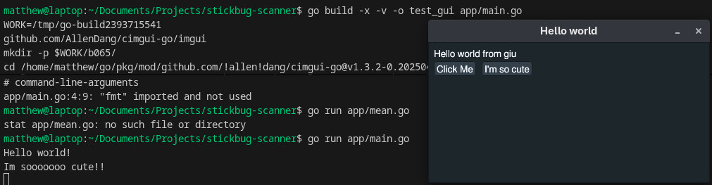
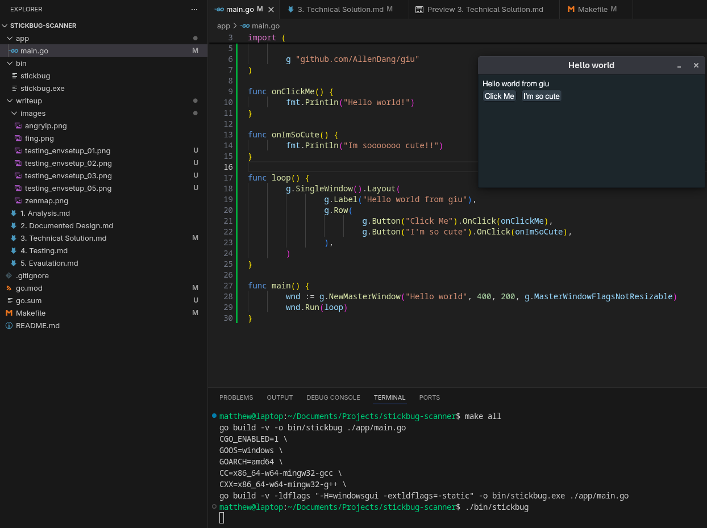
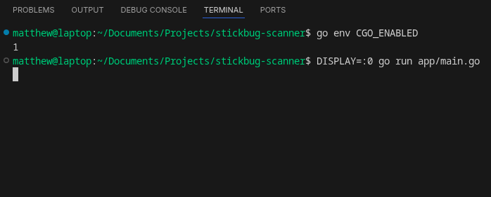

# Technical Solution

<br>

Environment Setup
---
#### Plan:
First thing first, I am using gui, which relies on underlying c++ (Dear ImGUI). As such, I need a c++ compiler installed.

Next, I installed the gui library by importing the package at the top of the page, and using "go mod tidy" to automatically download and install any required modules.

I also think that writing a quick make file to allow me to quickly compile for both windows and linux would be very helpful.


#### Code:
I used the following command on Linux to install my C++ compiler:
```
sudo dnf group install c-development development-tools
```
Then to install the UI library, I pasted in their Hello World example, and used "go mod tidy" to install the required packages.

```
package main

import (
        "fmt"

        g "github.com/AllenDang/giu"
)

func onClickMe() {
        fmt.Println("Hello world!")
}

func onImSoCute() {
        fmt.Println("Im sooooooo cute!!")
}

func loop() {
        g.SingleWindow().Layout(
                g.Label("Hello world from giu"),
                g.Row(
                        g.Button("Click Me").OnClick(onClickMe),
                        g.Button("I'm so cute").OnClick(onImSoCute),
                ),
        )
}

func main() {
        wnd := g.NewMasterWindow("Hello world", 400, 200, g.MasterWindowFlagsNotResizable)
        wnd.Run(loop)
}
```

When this didnt work, I realised that although I had the c++ compiler installed, I didnt have the windowing subsystems that the underlying code relied on. To install these, I used:
```
sudo dnf install libX11-devel libXcursor-devel libXrandr-devel libXinerama-devel libXi-devel mesa-libGL-devel libXxf86vm-devel wayland-devel libxkbcommon-devel
```
I also verified that CGO was enabled with the following, but still the same result. No window
```
go env CGO_ENABLED
```
I was a little stumped for a while, so as a shot in the dark, I used the following flag -x to get an "extra verbose" output and gain a little more information. Surprisingly, I saw that the code was compiling, it was just taking a really long time as it was the first build of all of the dependancies. I was just being very impatient because I was expecting Go's usual speedy bulid process.


Next, the make file for cross compilation.
I needed to install the MinGW toolchain for cross-compilation from Linux:
```
sudo dnf install mingw64-gcc mingw64-gcc-c++
```

After a lot of web searches (the following links were the most helpful), I had the following Makefile.  
https://tutorialedge.net/golang/makefiles-for-go-developers/
https://www.alexedwards.net/blog/a-time-saving-makefile-for-your-go-projects

```
BINARY_NAME=stickbug
MAIN_PATH=./app/main.go

.PHONY: all linux windows clean

all: linux windows

linux:
	go build -v -o bin/$(BINARY_NAME) $(MAIN_PATH)

windows:
	CGO_ENABLED=1 \
	GOOS=windows \
	GOARCH=amd64 \
	CC=x86_64-w64-mingw32-gcc \
	CXX=x86_64-w64-mingw32-g++ \
	go build -v -ldflags "-H=windowsgui -extldflags=-static" -o bin/$(BINARY_NAME).exe $(MAIN_PATH)

clean:
	rm -rf bin/
```



#### Testing:
| Objective Tested | Input Data | Expected Result | Actual Result | Image | Pass/Fail |
|-|-|-|-|-|-|
|Hello World code runs|go run app/main.go|A window opens|The code just hangs and nothing appears|  | Fail |
|Hello World code runs|go run app/main.go|A window opens|The code just hangs and nothing appears|  | Fail |
|Hello World code runs|go build -x -v -o test_gui app/main.go && ./test_gui|A window opens|It does actually open, and the buttons work!|  | Success |
|Hello World code runs from Makefile on linux|make linux|A window opens|stickbug binary is produced, and the Hello World window opens|  | Success |
|Hello World code runs from Makefile on windows|make windows|A window opens|stickbug binary.exe is produced, and the Hello World window opens|  | Success |

#### References:

https://github.com/AllenDang/giu#linux  
https://tutorialedge.net/golang/makefiles-for-go-developers/  
https://www.alexedwards.net/blog/a-time-saving-makefile-for-your-go-projects  

<br>

OOP Implementation
---
#### Plan:

#### Code:

#### Testing:
| Objective Tested | Input Data | Expected Result | Actual Result | Pass/Fail |
|-|-|-|-|-|

#### References:

<br>

UI
---
#### Plan:

#### Code:

#### Testing:
| Objective Tested | Input Data | Expected Result | Actual Result | Pass/Fail |
|-|-|-|-|-|

#### References:

<br>

Device Scan
---
#### Plan:

#### Code:

#### Testing:
| Objective Tested | Input Data | Expected Result | Actual Result | Pass/Fail |
|-|-|-|-|-|

#### References:

<br>

Port Scan
---
#### Plan:

#### Code:

#### Testing:
| Objective Tested | Input Data | Expected Result | Actual Result | Pass/Fail |
|-|-|-|-|-|

#### References:

<br>

Vulnerability Scan
---
#### Plan:

#### Code:

#### Testing:
| Objective Tested | Input Data | Expected Result | Actual Result | Pass/Fail |
|-|-|-|-|-|

#### References:

<br>

Database Interation
---
#### Plan:

#### Code:

#### Testing:
| Objective Tested | Input Data | Expected Result | Actual Result | Pass/Fail |
|-|-|-|-|-|

#### References:

<br>

Linking Modular Code Together
---
#### Plan:

#### Code:

#### Testing:
| Objective Tested | Input Data | Expected Result | Actual Result | Pass/Fail |
|-|-|-|-|-|

#### References:

<br>

Filtering
---
#### Plan:

#### Code:

#### Testing:
| Objective Tested | Input Data | Expected Result | Actual Result | Pass/Fail |
|-|-|-|-|-|

#### References:

<br>

Device Location
---
#### Plan:

#### Code:

#### Testing:
| Objective Tested | Input Data | Expected Result | Actual Result | Pass/Fail |
|-|-|-|-|-|

#### References:

<br>

Remote Device Management
---
#### Plan:

#### Code:

#### Testing:
| Objective Tested | Input Data | Expected Result | Actual Result | Pass/Fail |
|-|-|-|-|-|

#### References: